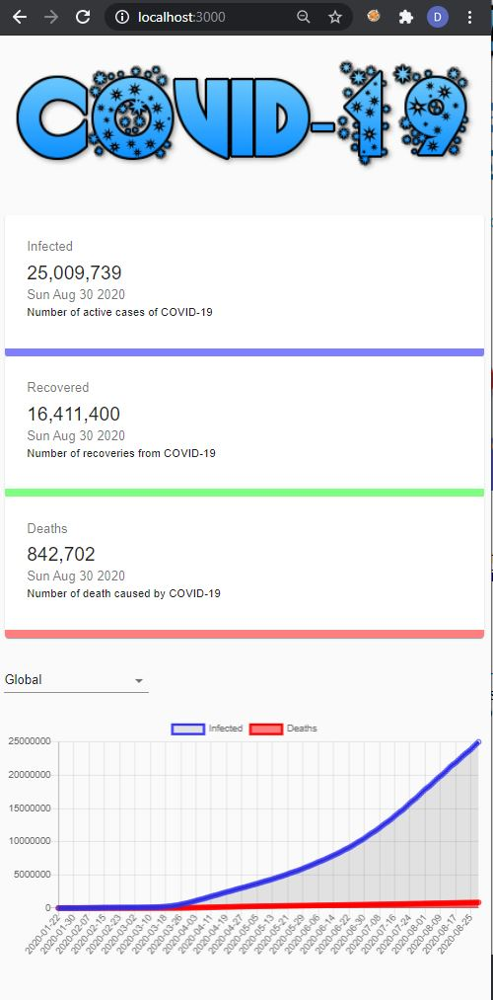
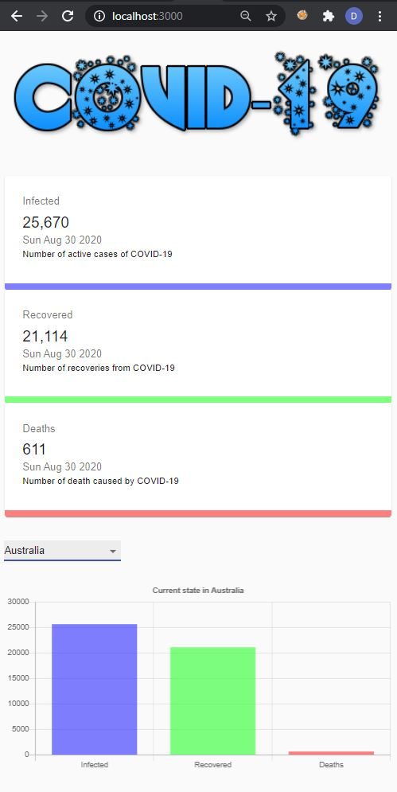

# COVID19Tracker
A COVID19 tracker created in ReactJs | MaterialUI | ChartJS

API used: https://covid19.mathdro.id/api
https://github.com/mathdroid/covid-19-api
Data from John Hopkins University CSSE as a JSON API

### `npm start`

Runs the app in the development mode. 
Open [http://localhost:3000](http://localhost:3000) to view it in the browser.

The page will reload if you make edits. 
You will also see any lint errors in the console.

## Screenshots

